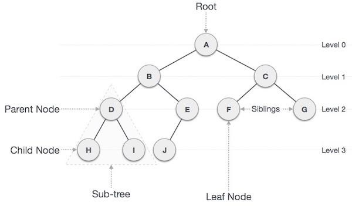

# 樹 (Tree)

## 1. 核心定義 (Definition)

樹 (Tree) 是一種**非線性 (Non-linear)** 的階層式資料結構，由節點 (Node) 與邊 (Edge) 組成，具有無迴圈 (Acyclic) 的特性 。
它模擬了自然界樹木的結構（但在電腦科學中通常是**根在上、葉在下**的倒置樹）。

* **用途**：表示具有層次關係的資料，如檔案系統、組織架構圖、決策樹、DOM 樹等。
* **與鏈結串列的關係**：
    * **Linked List**：線性結構，每個節點指向下一個節點 (Next) 。
    * **Tree**：分支結構，每個節點可以指向多個子節點 (Children)，從「線性」轉變為「階層」。

## Visualization  
* 其他變化可參考 [AssignmentV](https://github.com/raozhin/11401_CS203A/blob/main/Assignment/AssignmnetV/1133305_DS_Assignment_V.pdf)



---

## 2. 重要術語 (Terminology)

掌握以下術語對於理解樹的演算法至關重要 ：

* **Root (根)**：樹的最頂層節點，沒有父節點。
* **Parent (父節點)**：一個節點的上層節點。
* **Child (子節點)**：一個節點指向的下層節點。
* **Sibling (兄弟節點)**：擁有相同父節點的節點。
* **Leaf (葉節點)**：沒有子節點的節點 (度數為 0)。
* **Degree (分支度/度數)**：一個節點擁有的子樹/子節點數量。樹的 Degree 為所有節點中最大的 Degree。
* **Level (層級)**：根節點為 Level 1 (或 0)，其子節點為 Level 2，依此類推。
* **Height (高度)** / **Depth (深度)**：樹的最大層級數。

---

## 3. 二元樹 (Binary Tree)

### 3.1 定義
一種特殊的樹，每個節點**最多只有兩個子節點**，分別稱為**左子節點 (Left Child)** 與 **右子節點 (Right Child)** 。

### 3.2 特殊形態
1.  **Full Binary Tree (完滿二元樹)**：每個節點要馬是葉節點，要馬有兩個子節點 (Degree 為 0 或 2)。
2.  **Complete Binary Tree (完全二元樹)**：除了最後一層外，其他層節點全滿，且最後一層的節點都靠左排列。
3.  **Perfect Binary Tree (完美二元樹)**：所有內部節點都有兩個子節點，且所有葉節點都在同一層。

### 3.3 二元搜尋樹 (Binary Search Tree, BST)
一種具備排序特性的二元樹，滿足以下條件 ：
* **Left Subtree < Root**：左子樹所有節點的值皆小於根節點。
* **Right Subtree > Root**：右子樹所有節點的值皆大於根節點。
* **優點**：提供 $O(\log n)$ 的快速搜尋、插入與刪除 (若樹保持平衡)。

---

## 4. 樹的走訪 (Tree Traversal)

遍歷樹中所有節點的方法，主要分為**深度優先 (DFS)** 與 **廣度優先 (BFS)** 。

### 4.1 深度優先搜尋 (DFS) - 使用 Stack (或遞迴)
1.  **前序走訪 (Pre-order)**: `Root` -> `Left` -> `Right` (適用於複製樹)。
2.  **中序走訪 (In-order)**: `Left` -> `Root` -> `Right` (對 BST 走訪可得到**排序後**的數列)。
3.  **後序走訪 (Post-order)**: `Left` -> `Right` -> `Root` (適用於刪除樹或計算目錄大小)。

### 4.2 廣度優先搜尋 (BFS) - 使用 Queue
* **層序走訪 (Level-order)**: 從根節點開始，一層一層由左至右走訪。


---

## 5. 複雜度分析 (Complexity Analysis)

令 $n$ 為節點總數， $h$ 為樹的高度。

| 操作 | 平均情況 (Balanced) | 最壞情況 (Skewed) | 說明 |
| :--- | :---: | :---: | :--- |
| **Search (BST)** | $O(\log n)$ | $O(n)$ | 若樹退化成 Linked List (歪斜樹) |
| **Insert (BST)** | $O(\log n)$ | $O(n)$ | 同上 |
| **Delete (BST)** | $O(\log n)$ | $O(n)$ | 同上 |
| **Traversal** | $O(n)$ | $O(n)$ | 必須訪問每個節點一次 |

* **空間複雜度**：
    * 儲存： $O(n)$。
    * 遞迴堆疊 (Auxiliary)：平均 $O(\log n)$，最壞 $O(n)$ 。

---

## 6. 實作範例 (C Code Snippet)

定義一個二元樹節點與基本的中序走訪：

```c
#include <stdio.h>
#include <stdlib.h>

// 節點結構定義
typedef struct Node {
    int data;
    struct Node* left;
    struct Node* right;
} Node;

// 建立新節點
Node* createNode(int value) {
    Node* newNode = (Node*)malloc(sizeof(Node));
    newNode->data = value;
    newNode->left = NULL;
    newNode->right = NULL;
    return newNode;
}

// 中序走訪 (In-order Traversal): Left -> Root -> Right
void printInOrder(Node* root) {
    if (root == NULL) return;
    printInOrder(root->left);
    printf("%d ", root->data);
    printInOrder(root->right);
}
```

---

## 7. 優缺點總結 (Pros & Cons)

優點 (Pros) 

* **階層表示**：自然地表達階層關係 (如 HTML DOM)。
* **搜尋效率**：BST 平均提供  搜尋，優於 Linked List 的 。
* **動態結構**：不像陣列需預先配置大小，插入刪除彈性高。

缺點 (Cons) 

* **指標開銷**：每個節點需額外儲存左右指標 (Overhead)。
* **平衡問題**：若未平衡 (Unbalanced)，BST 可能退化成線性結構，導致效能變差 (需使用 AVL Tree 或 Red-Black Tree 修正)。
* **實作複雜**：指標操作與遞迴邏輯較陣列複雜。

```
